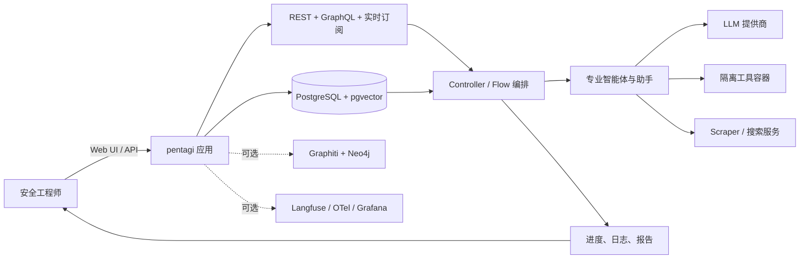
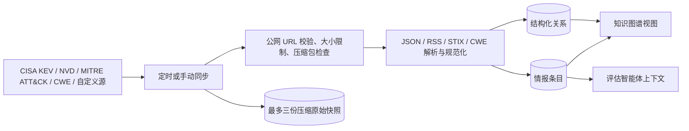
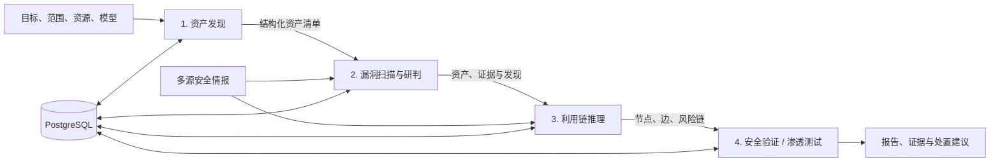
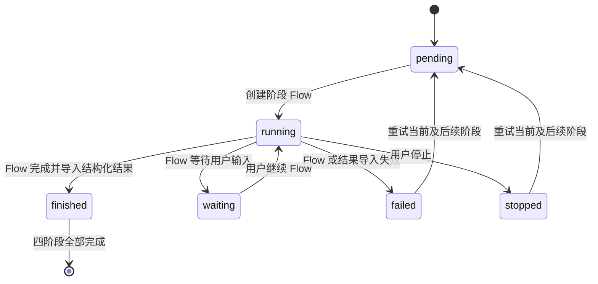

# pent-zh 部署条件与流程架构

本文对应当前仓库代码，用于新环境部署、现有环境更新和系统链路理解。更细的本机历史部署记录见 [DEPLOYMENT.md](DEPLOYMENT.md)，上游完整配置项见 [backend/docs/config.md](backend/docs/config.md)。

## 1. 部署条件

### 1.1 基础环境

| 项目 | 最低条件 | 建议 |
| --- | --- | --- |
| 操作系统 | 支持 Docker 的 Linux、Windows 或 macOS | 生产环境优先 Linux；本仓库当前本地更新脚本面向 Windows PowerShell |
| 容器运行时 | Docker 与 Docker Compose v2（也可按上游文档适配 Podman） | Docker Desktop 或 Docker Engine 最新稳定版 |
| CPU | 2 vCPU | 4 vCPU 以上；并发扫描或启用知识图谱时继续增加 |
| 内存 | 4 GB | 8 GB 以上；同时运行 Graphiti、Neo4j、Langfuse 时需额外预留 |
| 磁盘 | 20 GB 可用空间 | 30 GB 以上，并持续监控数据库、镜像和扫描产物增长 |
| 网络 | 可拉取容器镜像并访问所选模型服务 | 情报同步还需访问 CISA、NVD、MITRE 等数据源 |

从源码构建前端还需要 Node.js 与 `pnpm`。后端由 `Dockerfile.local` 内的 Go 1.26.5 构建镜像完成，主机无需单独安装 Go。当前 Windows 更新脚本要求 PowerShell，并依赖本机 Docker 命令可用。

### 1.2 必需配置

1. 从 `.env.example` 复制生成 `.env`，不要把真实 `.env`、密钥或账号文件提交到 Git。
2. 至少配置一个可用的 LLM 提供商，例如 OpenAI、Anthropic、Gemini、DeepSeek、GLM、Kimi、Qwen、MiniMax、Ollama 或 OpenAI 兼容服务。
3. 修改默认安全值，至少包括 `COOKIE_SIGNING_SALT`、PostgreSQL 密码，以及启用可选组件时 Neo4j、Langfuse、MinIO、Redis 等服务的默认密码。
4. 确认入口地址与监听配置一致：`PUBLIC_URL`、`CORS_ORIGINS`、`SERVER_USE_SSL`、`PENTAGI_LISTEN_IP` 和 `PENTAGI_LISTEN_PORT`。
5. 如需让智能体启动工具容器，配置 Docker 访问。生产环境建议使用独立工作节点和 TLS 保护的 Docker-in-Docker，不建议把宿主机 Docker Socket 直接交给智能体。

### 1.3 当前 Compose 核心服务

| 服务 | 作用 | 默认关系 |
| --- | --- | --- |
| `pentagi` | Go 后端、REST/GraphQL API、前端静态页面、智能体编排 | 等待 `pgvector` 健康后启动，默认发布 8443 端口 |
| `pgvector` | 业务数据库、流程记录、日志、向量记忆、情报及评估数据 | 使用持久化卷 `pentagi-postgres-data` |
| `scraper` | 浏览器与网页抓取能力 | 供智能体搜索和采集网页材料 |
| `pgexporter` | PostgreSQL 指标导出 | 供可选的可观测性栈采集 |

Graphiti/Neo4j、Langfuse，以及 Grafana、Loki、Jaeger 等可观测性组件使用独立 Compose 文件按需启用，不是基础启动的硬依赖。

## 2. 部署方式

### 2.1 首次部署

```powershell
Copy-Item .env.example .env
# 编辑 .env，至少配置模型服务、入口地址和安全密码
docker compose up -d
docker compose ps
```

默认入口为 `https://localhost:8443`。如果像当前本机环境一样关闭 TLS，则设置 `SERVER_USE_SSL=false`，并同步把 `PUBLIC_URL`、`CORS_ORIGINS` 改为 `http://localhost:8443`。仅本机使用时建议设置 `PENTAGI_LISTEN_IP=127.0.0.1`。

首次启动后应完成以下检查：

```powershell
docker compose ps
curl.exe -k -I https://localhost:8443
docker compose logs --tail 100 pentagi
```

若使用 HTTP，请把健康检查地址改为 `http://localhost:8443` 并去掉 `-k`。数据库迁移随应用启动执行；升级前应先备份生产数据库和持久化数据卷。

### 2.2 从当前源码构建并更新现有部署

当前仓库提供单套部署更新脚本：

```powershell
.\scripts\update.ps1
```

执行顺序如下：

1. 在 `frontend` 目录执行 `pnpm build`。
2. 使用 `Dockerfile.local` 编译后端，并运行控制器并发测试。
3. 生成 `pentagi-local:latest` 镜像。
4. 把 `.env` 中的 `PENTAGI_IMAGE` 更新为本地镜像。
5. 使用同一个 Compose 项目重建 `pentagi` 容器，保留数据库卷与配套服务。

已有且已验证的本地镜像可用以下命令仅重新部署：

```powershell
.\scripts\update.ps1 -DeployOnly
```

更新会短暂中断 Web 入口。构建失败时脚本不会替换正在运行的应用。生产环境不应照搬“无备份更新”的本机策略，应先做数据库与卷备份，再进行滚动或维护窗口升级。

## 3. 总体架构



系统以 `Flow` 为主要执行单元。后端负责权限、输入校验、状态机、持久化和流程调度；调查、推理、证据整理和报告内容由现有 Flow/Assistant 智能体运行时完成。工具调用、终端输出、消息链和状态变化写入 PostgreSQL，并通过实时接口反馈给前端。

## 4. 当前业务流程架构

### 4.1 情报采集与知识层



内置来源支持按日或按周调度，也可手动触发。解析结果按用户隔离并批量写入数据库；知识图谱页面读取真实节点和关系，而不是前端模拟数据。自定义源只允许公开的 HTTP/HTTPS 地址，并包含 DNS 重绑定防护、响应体与解压体大小限制。

### 4.2 研究平台功能链路

独立功能可以分别启动，也可以由安全评估统一串联：



- **资产发现**：智能体在授权范围内发现主机、域名、URL、网络、设备或云资产，输出约定的 `asset_inventory` 结构；后端校验后写入资产与服务表。
- **漏洞扫描**：仅加载当前用户选中的活动资产及已知端口/服务，智能体执行探测和研判，并保留对应 Flow 及原始证据。
- **利用链推理**：结合资产、漏洞和情报生成节点、边与多条候选利用链，前端以可筛选、可缩放和可拖动的关系图展示。
- **安全验证**：使用上一步已经形成的利用链作为输入，依据授权范围执行验证，避免重新虚构或重复推理目标。

### 4.3 安全评估编排状态机

安全评估不是一段提示词中的四个标题，而是后端持久化的四阶段编排。每个阶段有独立 Flow 和独立状态记录：



编排器每 30 秒推进未结束任务；读取列表或详情时也会即时推进。服务重启后会从数据库中的阶段和 Flow 状态继续。停止操作同时停止当前 Flow；重试会重置当前失败/停止阶段及其后续阶段。前三阶段固定使用自动 Flow，第四阶段沿用用户选择的自动执行或交互助手模式。

### 4.4 前端与管理面

当前前端包含仪表盘、情报中心、漏洞扫描、利用链、安全评估、报告系统管理，以及设置中的智能体管理入口。前端只负责发起请求、展示状态和组织交互；业务状态以服务端数据库为准。权限由后端校验，情报功能细分为查看、管理和同步权限。

## 5. 数据、安全与运维边界

- `.env`、模型密钥、OAuth 密钥、数据库密码和账号文件不得进入版本库。
- 所有扫描与验证必须限定在明确授权的目标和资源范围内。
- PostgreSQL 卷承载流程、日志、情报、资产、扫描与评估状态；删除卷会导致这些数据不可恢复。
- 单机开发可以直接使用本机 Docker；生产环境应把工具执行放到隔离工作节点，并限制网络、权限、CPU、内存和端口范围。
- 公网部署必须启用受信任证书、反向代理或等价 TLS 方案，并限制管理入口来源。
- 可选观测组件会记录模型调用或运行指标；启用前应确认数据合规、脱敏和保留策略。

## 6. 发布前检查清单

```powershell
# 后端核心测试
Set-Location backend
go test ./pkg/server/services ./pkg/controller

# 前端检查
Set-Location ..\frontend
pnpm test
pnpm build

# Compose 配置与运行状态
Set-Location ..
docker compose config --quiet
docker compose ps
```

至少确认：测试通过、前端可构建、Compose 配置有效、数据库已备份、目标授权范围明确、密钥未被 Git 跟踪、服务健康检查正常，再推送或部署。
