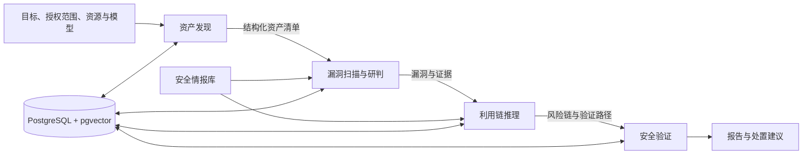

# pent-zh

面向中文安全研究场景的智能化资产发现、漏洞研判、利用链分析与安全评估平台。

平台以智能体 Flow 为执行核心，将安全情报、目标资产、漏洞证据和利用链统一组织为可追踪的评估流程。后端负责权限、范围校验、状态编排与数据持久化；智能体负责调查、工具调用、证据整理和报告生成。

> 本项目仅限用于已获得明确授权的安全测试、教学和研究活动。使用者必须遵守所在地法律法规并对测试范围负责。

## 核心能力

- 中文化的安全研究与任务管理界面。
- 多源安全情报采集，内置 CISA KEV、NVD、MITRE ATT&CK 和 MITRE CWE。
- 支持 JSON、RSS、STIX、CWE 等自定义公开情报源。
- 结构化资产发现与端口、服务、版本信息管理。
- 面向指定资产的漏洞扫描和证据研判。
- 漏洞利用链推理、风险评分和关系图展示。
- 资产发现、漏洞扫描、利用链推理、安全验证四阶段评估编排。
- 支持自动执行和交互助手两种安全验证方式。
- 持久化阶段状态，支持停止、失败重试与服务重启后继续推进。
- 流程日志、终端记录、文件、截图、报告和向量记忆统一留存。
- 报告系统管理、智能体设置和安全态势仪表盘。
- 支持多种云端或本地大语言模型服务。

## 当前流程



每个阶段拥有独立 Flow 和状态记录。后台编排器定期推进未结束任务，页面读取详情时也会即时同步状态。停止操作会终止当前 Flow；重试会重置当前阶段及其后续阶段。

## 系统组成

| 组件 | 作用 |
| --- | --- |
| `pentagi` | Web 页面、REST/GraphQL API、权限与智能体流程编排 |
| `pgvector` | 业务数据、流程记录、情报、评估状态与向量记忆 |
| `scraper` | 网页浏览、抓取和搜索辅助能力 |
| `pgexporter` | PostgreSQL 运行指标导出 |

Graphiti/Neo4j、Langfuse、Grafana、Loki 和 Jaeger 为可选组件，可按实际需要单独启用。

## 部署条件

- Docker 与 Docker Compose v2。
- 最低 2 vCPU、4 GB 内存和 20 GB 可用磁盘空间。
- 建议使用 4 vCPU、8 GB 以上内存和 30 GB 以上可用空间。
- 能够访问容器镜像、所选模型服务及需要同步的公开情报源。
- 至少配置一个可用的大语言模型服务。
- 从源码构建前端时需要 Node.js 和 `pnpm`。

完整的环境配置、安全建议与架构说明见 [部署条件与流程架构](DEPLOYMENT_ARCHITECTURE_ZH.md)。

## 快速启动

复制环境配置：

```powershell
Copy-Item .env.example .env
```

编辑 `.env`，至少完成以下配置：

- 一个可用的模型服务及其密钥或地址。
- `COOKIE_SIGNING_SALT` 和数据库密码等安全值。
- `PUBLIC_URL`、`CORS_ORIGINS`、监听地址和端口。
- 智能体工具容器需要使用的 Docker 访问方式。

启动基础服务：

```powershell
docker compose up -d
docker compose ps
```

默认访问地址：

```text
https://localhost:8443
```

如果在本机关闭 TLS，请同步设置：

```dotenv
SERVER_USE_SSL=false
PUBLIC_URL=http://localhost:8443
CORS_ORIGINS=http://localhost:8443
PENTAGI_LISTEN_IP=127.0.0.1
```

## 从源码更新

Windows PowerShell 环境可直接执行：

```powershell
.\scripts\update.ps1
```

脚本会依次完成前端构建、后端编译、控制器测试、本地镜像生成和现有容器替换。数据库卷与其他配套服务保持不变。

已有验证过的 `pentagi-local:latest` 镜像时，可仅执行部署：

```powershell
.\scripts\update.ps1 -DeployOnly
```

生产环境升级前必须先备份数据库和持久化数据卷。

## 主要页面

- **安全态势**：展示任务、资产、漏洞、利用链和评估进度。
- **情报中心**：管理情报源、执行同步并查看知识关系。
- **漏洞扫描**：选择已发现资产并启动智能体扫描。
- **利用链**：查看风险链、节点关系和推理结果。
- **安全评估**：创建并跟踪四阶段自动化评估。
- **报告系统管理**：集中管理报告生成与输出流程。
- **系统设置**：配置模型提供商、提示词、智能体和 API 令牌。

## 开发与检查

前端：

```powershell
Set-Location frontend
pnpm install
pnpm test
pnpm build
```

后端：

```powershell
Set-Location backend
go test ./pkg/controller
go test ./pkg/server/services
```

检查 Compose 配置：

```powershell
docker compose config --quiet
```

部分后端测试依赖 CGO 与 SQLite。在 Windows 上执行完整服务测试时，需要先准备支持 CGO 的 C 编译环境；也可在 Linux 或项目构建容器中运行。

## 数据与安全

- 不要提交 `.env`、模型密钥、OAuth 密钥、数据库密码或本地账号文件。
- 所有扫描和安全验证必须限定在明确授权的目标范围内。
- 生产环境建议把工具执行放到独立工作节点，并通过 TLS 保护的 Docker API 连接。
- 不建议把宿主机 Docker Socket 直接暴露给智能体。
- 对公网提供服务时必须启用可信 TLS、访问控制、强密码和定期备份。
- PostgreSQL 数据卷包含流程、日志、情报、资产和评估记录，删除后无法恢复。

## 文档

- [部署条件与流程架构](DEPLOYMENT_ARCHITECTURE_ZH.md)
- [当前本机部署与更新记录](DEPLOYMENT.md)
- [后端配置参考](backend/docs/config.md)
- [流程执行说明](backend/docs/flow_execution.md)

## 许可证

项目许可证及第三方许可信息见 [LICENSE](LICENSE)、[EULA.md](EULA.md) 和 [licenses](licenses)。
